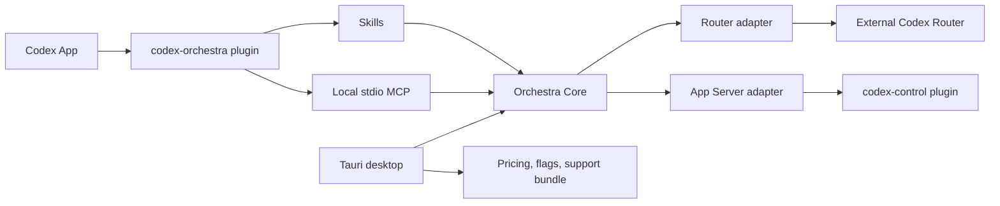

# Codex Orchestra

Windows-first local control plane for [Codex](https://github.com/openai/codex) and an external [Codex Router](https://github.com/duolahypercho/codex-router). It keeps Router health, logical team roles, managed project files and diagnostics coherent without becoming a second Codex chat UI.

The public surface is **plugin-first**: skills plus a local stdio MCP. The Tauri desktop app remains the advanced UI. ChatGPT chats in the same desktop app do not receive this local MCP.

[](https://github.com/falopass/Codex-Orchestra/actions/workflows/ci.yml)
[](LICENSE)

## Status

Public `v0.1.0` is an early, working alpha. Local plugin, core contracts and desktop flows exist. Live provider checks, signed desktop installers and rendered UI QA are still user-authorized or unfinished. Do not treat this as production-stable.

## What it solves

Codex Desktop executes work. Orchestra sits beside it and answers operational questions:

- Is Codex and Router healthy?
- Which models are visible, and are credentials present without revealing them?
- Which logical roles exist, and what files would Orchestra write?
- Can frontend and engineer work in parallel without colliding?
- How do I recover Router or inspect local usage without leaking secrets?

## Architecture



Codex Router stays an external engine, currently pinned to `v0.4.0-beta.3` (`a1be46aa02426d87a9e24e114ce8c22619c63c7a`). Orchestra does not vendor or reimplement it.

## Plugin vs desktop

| Surface                                                             | Plugin (skills + MCP)                             | Desktop                      |
| ------------------------------------------------------------------- | ------------------------------------------------- | ---------------------------- |
| Overview / health                                                   | `orchestra_status`, `orchestra_doctor`            | Full dashboard               |
| Router detect / doctor / start / restart / logs / update / rollback | `orchestra_router` with `confirm=true` for writes | Full helpers                 |
| Models / providers                                                  | Catalog and credential status, no secret values   | Same plus credential helpers |
| Team Builder                                                        | Logical roles, Auto / pinned                      | Full editor                  |
| Managed AGENTS / agents / skill                                     | Preview + atomic apply                            | Visual setup                 |
| Diagnostics / repair                                                | Doctor + confirmed local start                    | Live paid checks             |
| Usage / cost                                                        | Existing local events only                        | Pricing import / export      |
| Worktrees                                                           | Plan + create / remove when the flag is on        | Flag + review / recovery     |
| Threads                                                             | Bridge to `codex-control`                         | Run / App Server             |
| Settings / support bundle                                           | Deeplink to desktop                               | Full                         |

## Features and limits

Present in this release:

- Redacted health for Codex, Router, providers, desktop and thread control
- Router lifecycle through the adapter, never by inventing a second proxy
- Logical roles that stay separate from the current model ids
- Marker-bounded managed writes with preview, backup, atomic rename and rollback
- Worktree planning behind an explicit flag; merge stays manual
- Usage summaries from existing local events only
- Thread writes delegated to `codex-control`

Not claimed:

- Embedded plugin UI. The current Codex plugin format does not host one.
- ChatGPT receiving this local MCP automatically
- Automatic Router `main` tracking
- Automatic PAYG / Zen overflow
- Signed desktop binaries in GitHub Releases

## Requirements

- Windows-first. Linux / macOS are not first-class surfaces yet.
- Node.js 22.19+ for repo development. Node 24 is what this tree was last checked with.
- Python 3.12+ for the plugin CLI / MCP.
- Rust + Tauri 2 prerequisites only if you build the desktop app.
- A local Codex install. Codex Router is optional until you ask Orchestra to manage it.

## Install the plugin from GitHub

From a machine that already has Codex App / CLI:

```powershell
codex plugin marketplace add falopass/Codex-Orchestra
codex plugin add codex-orchestra@codex-orchestra
```

Start a **new Codex thread** after install so skills and MCP tools load.

If you cloned the repo instead:

```powershell
codex plugin marketplace add <absolute-path-to-this-repo>
codex plugin add codex-orchestra@codex-orchestra
```

The marketplace name comes from [`.agents/plugins/marketplace.json`](.agents/plugins/marketplace.json). The plugin id is `codex-orchestra`.

See [docs/PLUGIN.md](docs/PLUGIN.md) for troubleshooting and the current format limits.

## Onboarding

In a new Codex thread:

1. `$orchestra` or `/orchestra-setup`
2. `orchestra_status` / `orchestra_doctor` first
3. Give one absolute project path. Do not let the agent guess a home directory.
4. Preview managed files with `orchestra_setup`
5. Apply only with `orchestra_apply_managed` and `confirm=true`

CLI equivalent:

```powershell
python plugins\codex-orchestra\scripts\orchestra.py status
python plugins\codex-orchestra\scripts\orchestra.py doctor
python plugins\codex-orchestra\scripts\orchestra.py models
python plugins\codex-orchestra\scripts\orchestra.py setup --project <abs-path>
python plugins\codex-orchestra\scripts\orchestra.py apply <abs-path> --hash <preview-hash> --confirm
```

## Example commands

Read-only:

```text
orchestra_status
orchestra_doctor
orchestra_models
orchestra_team
orchestra_usage_summary
orchestra_threads
```

Writes and process changes need `confirm=true`:

```text
orchestra_router action=doctor
orchestra_router action=start confirm=true
orchestra_team ... confirm=true
orchestra_apply_managed project_path=<abs-path> expectedHash=<hash> confirm=true
orchestra_repair confirm=true
```

There are 13 MCP tools: `orchestra_status`, `orchestra_usage_summary`, `orchestra_scope_plan`, `orchestra_sync_status`, `orchestra_doctor`, `orchestra_models`, `orchestra_team`, `orchestra_router`, `orchestra_setup`, `orchestra_apply_managed`, `orchestra_repair`, `orchestra_worktrees`, `orchestra_threads`.

## Security

- Localhost / stdio only. Router defaults to `127.0.0.1`.
- Writes, process start and managed apply require `confirm=true`.
- Secrets stay in Router helpers or OS stores. Orchestra stores status, not key values.
- Managed files use Orchestra markers. Foreign `AGENTS.md` content is preserved.
- Support bundles are allow-listed and omit personal paths, prompts and native IDs.
- Do not commit `.env`, `%USERPROFILE%\.codex`, marketplace personal files or support bundles.

Report vulnerabilities through [GitHub Security Advisories](https://github.com/falopass/Codex-Orchestra/security/advisories/new). See [SECURITY.md](SECURITY.md).

## Local development

```powershell
npm install
npm run typecheck
npm test
npm run check:secrets
npm run build
```

Desktop:

```powershell
npm run dev
npm run tauri:dev
```

The browser shell is fixture-backed when Tauri is unavailable. Native desktop needs Rust and the Tauri Windows prerequisites. Redirect native artifacts with `CARGO_TARGET_DIR` if your checkout path contains non-ASCII characters.

Plugin validator:

```powershell
python $env:USERPROFILE\.codex\skills\.system\plugin-creator\scripts\validate_plugin.py plugins\codex-orchestra
```

Or, after cloning this repo on a machine with that Codex skill installed, use the same official validator. The repo does not vendor Codex internals.

## Tests

| Command                 | What it covers                                     |
| ----------------------- | -------------------------------------------------- |
| `npm test`              | Contracts, core and plugin Python tests            |
| `npm run typecheck`     | TypeScript contracts, core, adapters and desktop   |
| `npm run test:plugin`   | Plugin redaction, managed apply, MCP tool list     |
| `npm run test:rust`     | Native Rust suite when a Rust toolchain is present |
| `npm run check:secrets` | High-signal secret scan of the workspace           |
| `npm run format:check`  | Prettier check                                     |

Live Router, paid model checks and App Server turns are opt-in. The default suite never touches a real `%USERPROFILE%\.codex` or spends provider quota.

## Versioning

Public SemVer is `0.1.0` across the repo, plugin manifest and desktop package. Local Codex cachebusters such as `0.1.0+codex.<timestamp>` are for developer reinstalls and are not the published version.

## Docs

- [docs/PLUGIN.md](docs/PLUGIN.md) — install, marketplace, tools, confirms
- [docs/ARCHITECTURE.md](docs/ARCHITECTURE.md) — product boundary and layers
- [docs/OPERATIONS.md](docs/OPERATIONS.md) — Router lifecycle and recovery
- [docs/SECURITY.md](docs/SECURITY.md) — in-product security model
- [docs/DECISIONS/ADR-009-plugin-first-surfaces.md](docs/DECISIONS/ADR-009-plugin-first-surfaces.md)
- [CONTRIBUTING.md](CONTRIBUTING.md)
- [CHANGELOG.md](CHANGELOG.md)
- [NOTICE](NOTICE)

## Contributing

See [CONTRIBUTING.md](CONTRIBUTING.md). Small, reviewable changes. Do not commit personal Codex config, secrets or machine paths.

## License

[MIT](LICENSE)
