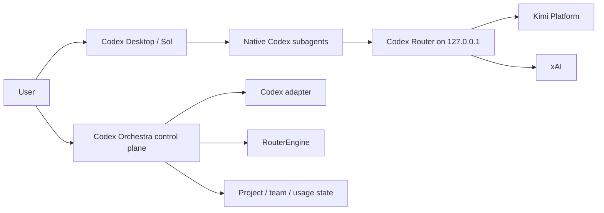

# Architecture

## Product boundary

Codex Desktop is the execution surface. GPT-5.6 Sol remains the root/orchestrator/reviewer. Codex Orchestra is a local control plane that configures, previews, diagnoses and observes. It is not a second Codex UI and does not execute provider inference itself.

## Layers

- `apps/desktop/src`: React presentation, navigation and honest states. It calls one adapter and never concatenates shell commands.
- `apps/desktop/src-tauri/src`: Rust boundary for executable detection, path validation, process arguments, redaction, SQLite state, atomic writes, backups and rollback.
- `packages/contracts`: shared domain types and pure functions used by renderer and tests.
- `templates`: generated Codex agents, skill and managed AGENTS block.
- `engine`: router lifecycle contract and upstream lock notes.

## Domain concepts

`CodexInstall`, `RouterInstall`, `Provider`, `Model`, `ModelBinding`, `AgentDefinition`, `ProjectProfile`, `RoutingPolicy`, `HealthReport`, `UsageEvent`, `CostBreakdown`, `Backup`, `ManagedConfig` and `UpdatePlan` are explicit contracts. A logical binding resolves against the live catalog; a UI label is not proof that a provider is authenticated.

SQLite lives under the local Orchestra data root (`CODEX_ORCHESTRA_DATA_DIR` for isolated tests, otherwise the OS local application-data directory). It stores project profiles, health history, usage events and redacted backup metadata only. It never stores credential values, prompts, responses or session files.

## UI direction

Specificity locks:

1. Thesis: an instrument panel for supervising model infrastructure, with a calm editorial rhythm rather than a generic developer dashboard.
2. Composition: persistent rail → current operational state → role/team matrix → action/diagnostic queue.
3. Typography: system sans for reading, condensed uppercase utility labels, monospace for IDs/numbers/paths.
4. Image strategy: no stock imagery; state is carried by precise icons, signal dots and sparse diagrams to avoid false product proof.
5. Motion: short rail selection underline, health pulse only while running, count transitions for usage; all disabled under reduced motion.
6. Proof rule: fixture-backed states are labeled as local/demo; provider authentication and live agent capability remain “pending live check” until verified.

## App Server / MCP boundary

The official Codex App Server is an optional stdio integration for live activity and controlled tests. The app-server handshake is `initialize` → `initialized`; thread/turn methods are not needed for the control-plane MVP. MCP is an optional read-only health/usage/sync surface. Neither is required for setup, router management or safety-critical config writes.
