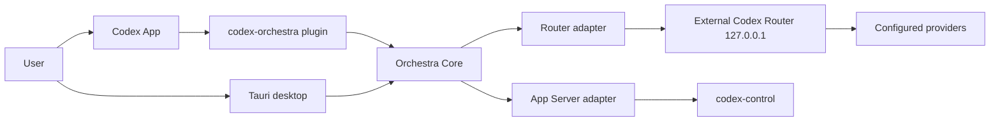

# Architecture

## Product boundary

Codex Desktop is the execution surface. GPT-5.6 Sol, Luna and Terra are
available native root models, each with the supported reasoning-effort ladder.
Codex Orchestra is a local control plane that configures, previews, diagnoses
and observes. It is not a second Codex UI and does not execute provider
inference itself.

## Layers

- `apps/desktop/src`: React presentation, navigation and honest states. It calls one adapter and never concatenates shell commands.
- `apps/desktop/src-tauri/src`: Rust boundary for executable detection, path validation, bounded process arguments, redaction, versioned SQLite state, atomic writes, backups, rollback, persisted team/project/worktree metadata, optional Codex App Server and read-only MCP stdio transports.
- `packages/contracts`: shared domain types and pure functions used by renderer and tests.
- `packages/orchestra-core`: plugin-facing core exports and feature map.
- `packages/adapters-codex-router` and `packages/adapters-codex-app-server`: contracts for the external Router engine and App Server/thread bridge.
- `plugins/codex-orchestra`: marketplace plugin (skills + local stdio MCP). No embedded plugin UI exists in the current Codex plugin format.
- `templates`: generated Codex agents, skill and managed AGENTS block.
- `engine`: router lifecycle contract and upstream lock notes.

## Domain concepts

`CodexInstall`, `RouterInstall`, `Provider`, `Model`, `ModelBinding`, `AgentDefinition`, `ProjectProfile`, `RoutingPolicy`, `HealthReport`, `UsageEvent`, `CostBreakdown`, `Backup`, `ManagedConfig` and `UpdatePlan` are explicit contracts. A logical binding resolves against the live catalog; a UI label is not proof that a provider is authenticated.

SQLite lives under the local Orchestra data root (`CODEX_ORCHESTRA_DATA_DIR` for isolated tests, otherwise the OS local application-data directory). Schema migrations are tracked through `PRAGMA user_version`; schema v3 stores project profiles, team definitions, managed worktree base revisions, the last 20 health runs, safe live-check status metadata, usage events, versioned pricing rules, feature flags, redacted operation logs, delegation evidence and backup metadata. It never stores credential values, prompts, responses or session files. Historical `unix:<seconds>` timestamps remain readable in the UI together with ISO timestamps, so existing state does not render as `Invalid Date` after upgrades.

The support bundle is a separate allow-listed projection, not a serialized
`OrchestraSnapshot`. It intentionally omits local paths, project identities,
backup targets, native Codex IDs, command output and log messages while keeping
the operational statuses needed for diagnosis.

The Windows idle budget is defined on private memory because WebView2 working
set includes shared/runtime pages: complete process tree <= 220 MiB private,
native Tauri host <= 16 MiB private and <= 20 MiB private growth after warm-up
over a 60-second smoke window. Working set is still recorded as diagnostic
context, with a 450 MiB smoke ceiling.

Team changes are validated against the fixed root/OpenAI, dynamic frontend
ModelBinding and engineer/xAI bindings before they are persisted. GPT-5.6 Sol is
the root technical lead. The frontend strategy defaults to Qwen 3.8 Max through
the Alibaba Token Plan; Kimi K3 through OpenCode Go is rendered as a separate,
selective visual/UI custom agent. The engineer binding defaults to
`grok-oauth/grok-4.6`, with `grok-api` retained as a separately billed
alternative. Cross-role work must return to Sol: Qwen, Grok and Kimi do not call
another primary worker, and concurrent writes require disjoint ownership. Setup
renders generated agent TOML files and the routing skill from those saved
definitions. Profile imports rebuild a local
project profile from an existing canonical path, then overlay only validated
ownership, routing and command metadata; an exported absolute path is never
trusted as an instruction to create or access a missing directory.

## UI direction

Specificity locks:

1. Thesis: an instrument panel for supervising model infrastructure, with a calm editorial rhythm rather than a generic developer dashboard.
2. Composition: persistent rail → current operational state → role/team matrix → action/diagnostic queue.
3. Typography: system sans for reading, condensed uppercase utility labels, monospace for IDs/numbers/paths.
4. Image strategy: no stock imagery; state is carried by precise icons, signal dots and sparse diagrams to avoid false product proof.
5. Motion: short rail selection underline, health pulse only while running, count transitions for usage; all disabled under reduced motion.
6. Proof rule: fixture-backed states are labeled as local/demo; provider authentication and live agent capability remain “pending live check” until verified.

The frontend role stores a logical strategy (`auto` or `pinned`) and resolves
provider-qualified model slugs from the current Router catalog. AUTO prefers
Qwen for ordinary frontend delivery and Kimi for visual/UI work. A pinned route
never silently switches providers, and PAYG fallback is not automatic. Context
and auto-compaction limits are copied only from current catalog metadata, so
Orchestra makes no hardcoded 1M-context claim. OpenCode Zen/PAYG is not
selected by this control plane.

Grok OAuth is launched through the official CLI (`grok login --oauth`) in a
visible terminal. Orchestra checks only the Router-reported status; it never
opens `~/.grok/auth.json` or copies the OAuth session. Cross-provider fallback
is not encoded as an automatic runtime promise because the reviewed Router pin
does not provide that policy surface.

## App Server / MCP boundary

The official Codex App Server is an opt-in local stdio integration. Orchestra starts
`codex app-server --listen stdio://`, completes `initialize` → `initialized`, then
creates one explicit native Codex thread and turn for the selected local project.
The renderer receives the streaming event feed only in memory: prompts, agent
messages, command output and approval details are never written to Orchestra's
SQLite database, support bundle or logs. On an authoritative
`item/completed` collaboration event, Rust may persist only an allow-listed
projection: local run ID, root model, requested binding, normalized action and
status, and whether a child thread was created. It first compares the in-memory
sender ID with the root thread and never persists either ID, the raw event,
prompt, response, arguments or paths. The user can interrupt the active turn,
close the process, and answer command/file approvals in the app. App Server does
not modify the user's `config.toml`; its existing Codex approval and sandbox
policy remains authoritative. MCP remains optional and is not required for setup,
router management or safety-critical config writes. When explicitly enabled,
the same executable can run with `--mcp-stdio` as a read-only local server. It
offers redacted status, aggregate usage, pure scope planning and managed-artifact
sync status; there is no MCP mutation or model-execution tool.
